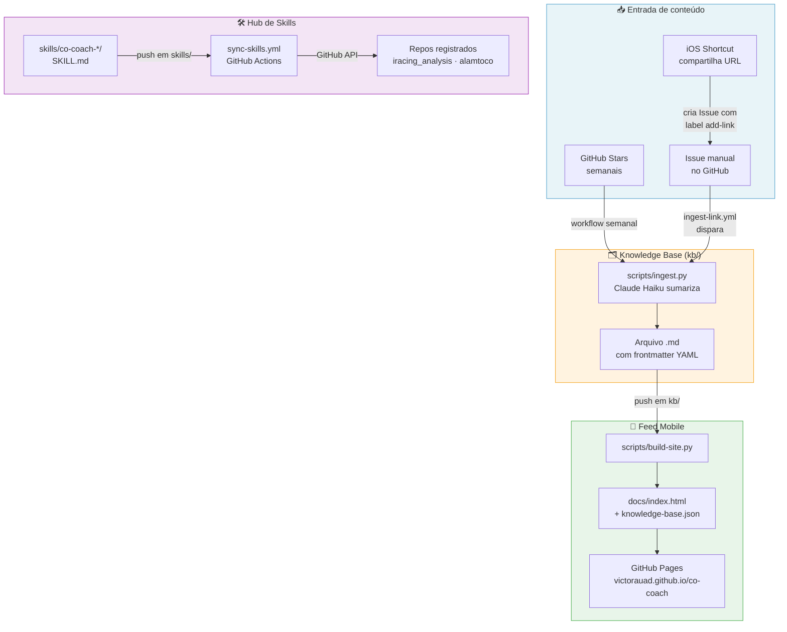
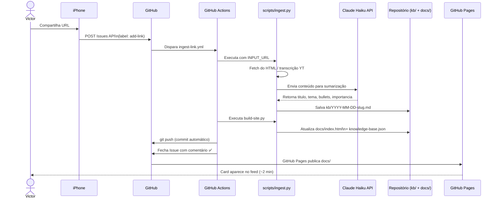
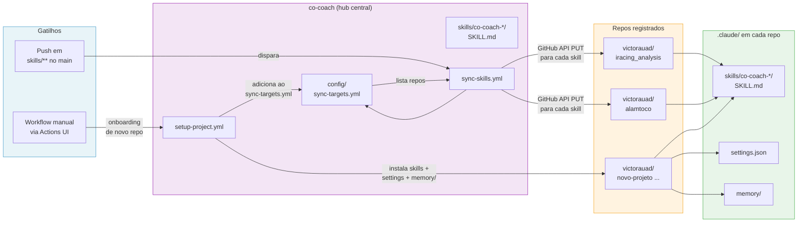

# co-coach — Diagramas do Sistema

> Renderiza automaticamente no GitHub. No VS Code, instale a extensão **Markdown Preview Mermaid Support**.

---

## 1. Visão geral — as 3 camadas

---

## 2. Fluxo de ingestão de conteúdo

---

## 3. Fluxo de distribuição de skills

